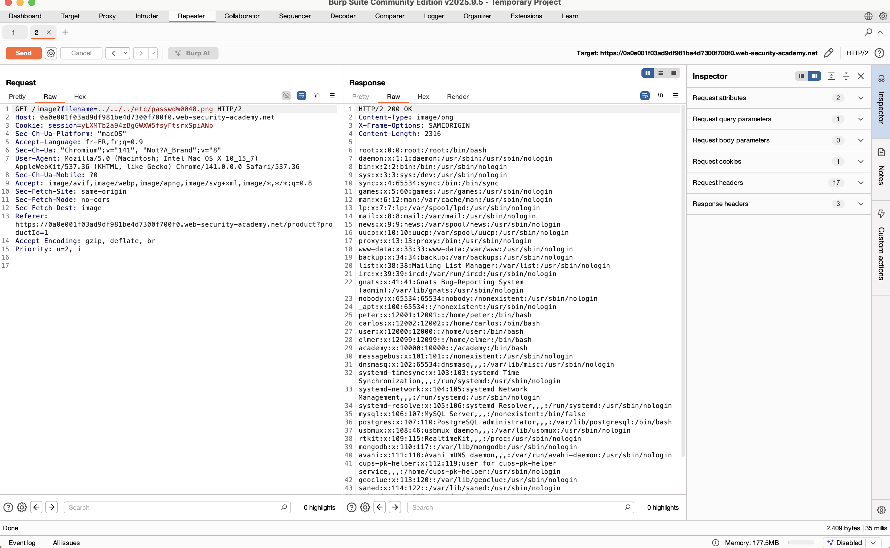

# Challenge 1: File path traversal, validation of file extension with null byte bypass

## Nom / URL

**Nom du challenge :** Lab: File path traversal, validation of file extension with null byte bypass
**URL :** https://portswigger.net/web-security/file-path-traversal/lab-validate-file-extension-null-byte-bypass
**Niveau :** PRACTITIONER

## Les étapes de découverte de la vulnérabilité

1. **Identification de la fonctionnalité vulnérable :**

   - L'application affiche des images de produits via un paramètre dans l'URL (par exemple `/image?filename=product.jpg`)
   - Le paramètre `filename` est utilisé pour charger des fichiers depuis le système de fichiers

2. **Test initial de path traversal :**

   - Tentative d'utiliser des séquences `../` pour remonter dans l'arborescence : `../../../etc/passwd`
   - L'application rejette la requête car elle valide que le fichier se termine par une extension autorisée (`.jpg`, `.png`, etc.)

3. **Découverte de la validation d'extension :**

   - L'application vérifie que le nom de fichier se termine par une extension valide
   - Les tentatives directes de path traversal sont bloquées par cette validation

4. **Exploitation du null byte bypass :**

   - Utilisation d'un caractère null byte (`%00` ou `\0`) pour terminer la chaîne avant l'extension
   - Le null byte permet de contourner la validation d'extension car certains systèmes/versions de langages interprètent le null byte comme la fin de la chaîne
   - Le payload final : `../../../etc/passwd%00.jpg` permet de :
     - Passer la validation d'extension (le fichier "se termine" par `.jpg`)
     - Accéder au fichier `/etc/passwd` (le null byte termine la chaîne avant `.jpg`)

5. **Confirmation de la vulnérabilité :**

   - Le contenu de `/etc/passwd` est retourné, confirmant l'accès non autorisé au système de fichiers

## Le payload utilisé + screenshot

**Payload utilisé :**

```
../../../etc/passwd%0048.jpg
```

**Explication du payload :**

- `../../../` : Remonte de 3 niveaux dans l'arborescence des répertoires
- `etc/passwd` : Fichier système cible contenant les informations des utilisateurs
- `%0048` : Encodage URL du caractère null byte (byte null)
- `.jpg` : Extension ajoutée pour contourner la validation

**Screenshot :**


## Les recommandations pour sécuriser cette vulnérabilité

### 1. Validation stricte des chemins de fichiers

- **Utiliser une whitelist** : Ne permettre l'accès qu'à des fichiers spécifiques dans un répertoire autorisé
- **Normaliser les chemins** : Utiliser des fonctions de normalisation de chemin qui résolvent les séquences `../` et les chemins absolus
- **Vérifier que le chemin final reste dans le répertoire autorisé** : Après normalisation, s'assurer que le chemin ne sort pas du répertoire de base

### 2. Gestion des null bytes

- **Supprimer ou rejeter les null bytes** : Filtrer tous les caractères null (`\0` ou `%00`) des entrées utilisateur
- **Valider avant et après décodage URL** : Effectuer la validation sur la chaîne décodée et non sur la version encodée

### 3. Utilisation de mappings de fichiers

- **Mapper les noms de fichiers** : Utiliser un système de mapping (par exemple, une base de données) qui associe des identifiants sécurisés aux fichiers réels
- **Éviter l'utilisation directe des noms de fichiers utilisateur** : Ne jamais utiliser directement les noms de fichiers fournis par l'utilisateur

### 4. Contrôle d'accès

- **Restreindre les répertoires accessibles** : Stocker les fichiers accessibles dans un répertoire dédié, séparé du système de fichiers principal
- **Utiliser des chemins absolus** : Construire les chemins de fichiers de manière absolue à partir d'un répertoire de base configuré

### 5. Validation d'extension renforcée

- **Valider l'extension de manière stricte** : Vérifier que l'extension correspond réellement au type de fichier
- **Ne pas se fier uniquement à l'extension** : Utiliser la validation du type MIME ou l'analyse du contenu du fichier

## Références

**Source principale des recommandations :**

- **OWASP - Path Traversal** : [https://owasp.org/www-community/attacks/Path_Traversal]()
  - Cette page OWASP fournit des informations détaillées sur les attaques de path traversal et les meilleures pratiques de sécurisation

**Références complémentaires :**

- **PortSwigger Web Security Academy - File path traversal** : [https://portswigger.net/web-security/file-path-traversal]()

  - Documentation officielle de PortSwigger sur les vulnérabilités de path traversal

- **CWE-23: Relative Path Traversal** : https://cwe.mitre.org/data/definitions/23.html

  - Classification CWE de cette vulnérabilité avec des exemples et des solutions

- **OWASP Top 10 - A01:2021 Broken Access Control** : [https://owasp.org/Top10/A01_2021-Broken_Access_Control/]()

  - Les vulnérabilités de path traversal sont souvent liées à des problèmes de contrôle d'accès
