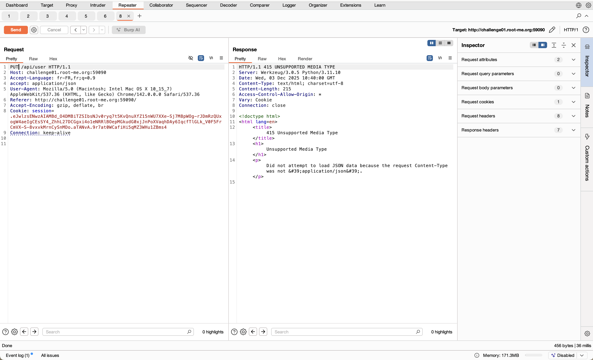
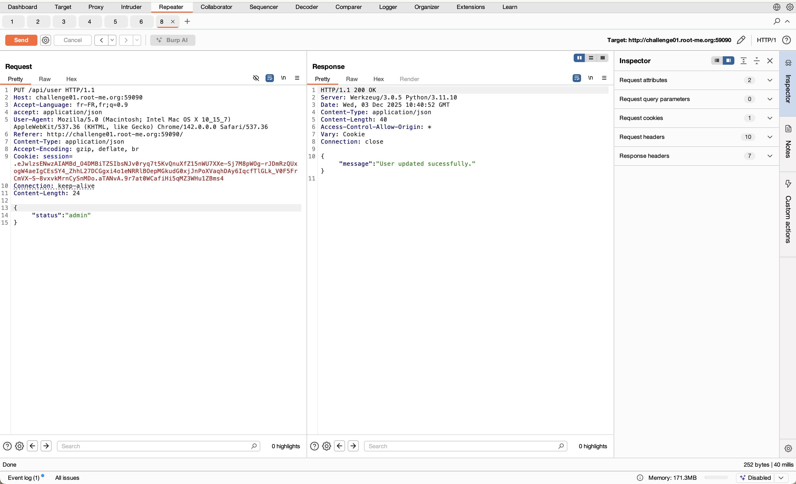
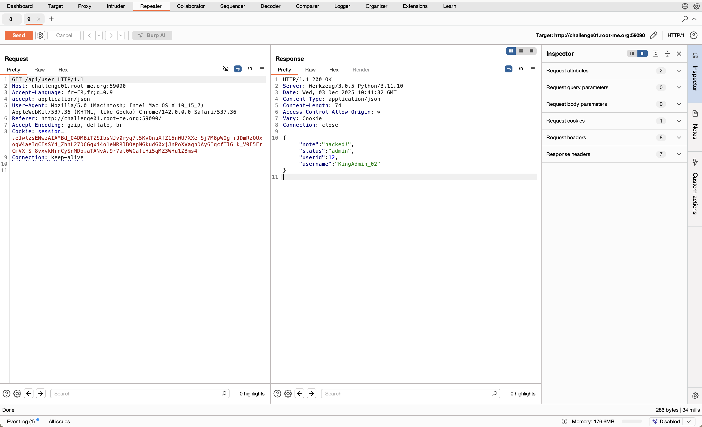

# Challenge 11: API - Mass Assignment

## Nom / URL

**Nom du challenge :** API - Mass Assignment  
**URL :** https://www.root-me.org/fr/Challenges/Web-Serveur/API-Mass-Assignment  
**Niveau :** 20 Points

## Les étapes de découverte de la vulnérabilité

1. **Contexte et reconnaissance :**
   - Cible : Une API REST documentée via Swagger (OpenAPI)
   - Objectif : Obtenir le flag situé sur la route `/api/flag`, accessible uniquement aux administrateurs
   - Analyse initiale de la documentation Swagger pour identifier les routes disponibles
   - La route `GET /api/user` renvoie un objet JSON contenant un champ intéressant : `"status": "guest"`

2. **Identification des routes documentées :**
   - La documentation Swagger expose une route `PUT /api/note` (modification de note)
   - Route `POST /api/signup` (inscription) également documentée
   - Observation : Le champ `status` dans la réponse de `/api/user` suggère qu'il pourrait être modifiable

3. **Tentatives infructueuses (fausses pistes) :**
   - **Tentative 1 (Update Note)** : Injection de `"status": "admin"` dans la route `PUT /api/note`
     - Échec : Le développeur a sécurisé cette route spécifique avec un whitelisting des champs autorisés
   - **Tentative 2 (Signup)** : Injection de `"status": "admin"`, `"role": "admin"`, `"is_admin": true` lors de l'inscription (`POST /api/signup`)
     - Échec : Les champs supplémentaires sont ignorés à la création, probablement filtrés côté serveur

4. **Découverte de la vulnérabilité :**
   - **Hypothèse** : Existence d'une route `PUT /api/user` (standard REST pour la mise à jour de profil) non documentée dans Swagger
   - Cette route "shadow API" (API cachée) n'apparaît pas dans la documentation mais suit les conventions REST
   - Les routes non documentées sont souvent moins sécurisées car elles ne sont pas soumises au même niveau de revue

5. **Exploitation de la vulnérabilité Mass Assignment :**
   - **Méthode** : `PUT`
   - **Endpoint** : `/api/user`
   - **Header obligatoire** : `Content-Type: application/json` (ajouté manuellement car non géré par défaut sur cette route cachée)
   - **Payload JSON** : `{"status": "admin"}`
   - **Résultat** : Le serveur a répondu `200 OK`
   - **Vérification** : Une requête `GET /api/user` a confirmé le passage du status à `"admin"`

6. **Confirmation de la vulnérabilité :**
   - Accès autorisé à `GET /api/flag` après la modification du statut
   - Le flag est récupéré avec succès

## Le payload utilisé + screenshot

**Payload utilisé :**

```json
{
  "status": "admin"
}
```

**Requête HTTP complète :**

```
PUT /api/user HTTP/1.1
Host: vulnerable-api.com
Content-Type: application/json
Content-Length: 20

{"status": "admin"}
```

**Explication du payload :**
- **Méthode PUT** : Méthode HTTP standard pour la mise à jour de ressources
- **Endpoint `/api/user`** : Route non documentée mais conforme aux conventions REST
- **Champ `status`** : Champ sensible qui contrôle les privilèges d'accès
- **Valeur `admin`** : Élève les privilèges de l'utilisateur de "guest" à "admin"
- **Mass Assignment** : L'API accepte directement les champs du payload sans validation stricte

**Screenshots :**








## Les recommandations pour sécuriser cette vulnérabilité

### 1. Whitelisting strict des champs
- **Liste blanche explicite** : Ne permettre que les champs explicitement autorisés dans les requêtes de mise à jour
- **Rejeter les champs inconnus** : Tous les champs non listés dans la whitelist doivent être rejetés
- **Validation côté serveur** : Ne jamais faire confiance aux données client, valider strictement côté serveur

### 2. Documentation complète de l'API
- **Documenter toutes les routes** : Toutes les routes API doivent être documentées, y compris celles qui suivent les conventions REST
- **Éviter les "Shadow APIs"** : Ne pas créer de routes non documentées qui pourraient être découvertes par déduction
- **Swagger/OpenAPI complet** : Maintenir une documentation OpenAPI à jour et complète

### 3. Séparation des champs modifiables et sensibles
- **Champs modifiables par l'utilisateur** : Identifier clairement quels champs peuvent être modifiés par l'utilisateur
- **Champs sensibles en lecture seule** : Les champs comme `status`, `role`, `is_admin` ne doivent jamais être modifiables directement par l'utilisateur
- **Routes dédiées pour les privilèges** : Utiliser des routes administratives séparées pour la gestion des privilèges

### 4. Validation et sanitisation
- **Validation stricte des types** : Vérifier que les types de données correspondent aux attentes
- **Validation des valeurs** : Vérifier que les valeurs sont dans une liste autorisée (ex: status ne peut être que "guest" ou "admin")
- **Sanitisation** : Nettoyer et valider toutes les entrées avant traitement

### 5. Tests de sécurité
- **Tests de Mass Assignment** : Inclure des tests qui vérifient la résistance aux attaques de Mass Assignment
- **Tests des routes non documentées** : Tester également les routes qui suivent les conventions REST mais ne sont pas documentées
- **Tests d'autorisation** : Vérifier que les utilisateurs ne peuvent pas modifier leurs propres privilèges

## Références

**Source principale des recommandations :**

- **OWASP - Mass Assignment** : https://cheatsheetseries.owasp.org/cheatsheets/Mass_Assignment_Cheat_Sheet.html
  - Cette page OWASP fournit des informations détaillées sur les vulnérabilités de Mass Assignment et les meilleures pratiques de sécurisation

**Références complémentaires :**

- **OWASP API Security Top 10 - API5:2023 Broken Function Level Authorization** : https://owasp.org/API-Security/editions/2023/en/0xa5-broken-function-level-authorization/
  - Les vulnérabilités de Mass Assignment sont souvent liées à des problèmes d'autorisation au niveau fonctionnel

- **CWE-915: Improperly Controlled Modification of Dynamically-Determined Object Attributes** : https://cwe.mitre.org/data/definitions/915.html
  - Classification CWE de cette vulnérabilité avec des exemples et des solutions

- **PortSwigger Web Security Academy - Mass Assignment** : https://portswigger.net/web-security/access-control/idor
  - Documentation sur les problèmes de contrôle d'accès liés au Mass Assignment

- **OWASP Top 10 - A01:2021 Broken Access Control** : https://owasp.org/Top10/A01_2021-Broken_Access_Control/
  - Les vulnérabilités de Mass Assignment font partie des problèmes de contrôle d'accès

- **REST API Security Best Practices** : https://owasp.org/www-project-web-security-testing-guide/latest/4-Web_Application_Security_Testing/11-Client_Side_Testing/10-Testing_for_Mass_Assignment
  - Guide de test pour identifier les vulnérabilités de Mass Assignment dans les APIs REST
