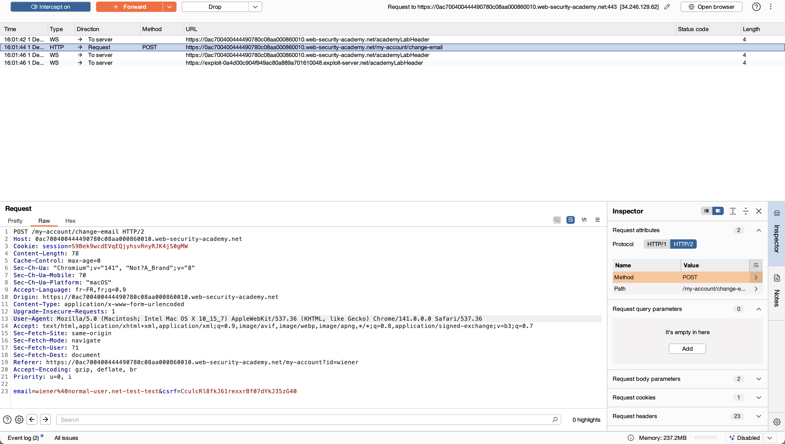
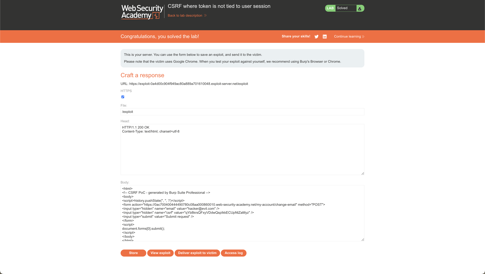

# Challenge 4: CSRF where token is not tied to user session

## Nom / URL

**Nom du challenge :** Lab: CSRF where token is not tied to user session  
**URL :** https://portswigger.net/web-security/csrf/bypassing-token-validation/lab-token-not-tied-to-user-session  
**Niveau :** PRACTITIONER

## Les étapes de découverte de la vulnérabilité

1. **Identification de la fonctionnalité vulnérable :**

   - L'application propose une fonctionnalité de changement d'adresse email
   - Cette fonctionnalité utilise un formulaire avec un token CSRF pour tenter de prévenir les attaques CSRF

2. **Analyse de la protection CSRF :**

   - L'application génère et valide des tokens CSRF lors de la soumission du formulaire
   - Test initial : tentative d'attaque CSRF classique sans token - échec (l'application rejette la requête)

3. **Découverte du défaut de validation :**

   - Connexion avec le compte `wiener:peter` et interception de la requête de changement d'email
   - Noter la valeur du token CSRF dans la requête
   - Connexion avec un autre compte (`carlos:montoya`) dans une fenêtre privée/incognito
   - Envoi de la requête de changement d'email dans Burp Repeater avec le compte `carlos`
   - Remplacement du token CSRF par celui du compte `wiener` - la requête est acceptée !

4. **Compréhension de la vulnérabilité :**

   - Le token CSRF n'est pas lié à la session utilisateur
   - N'importe quel token CSRF valide peut être utilisé, même s'il provient d'une autre session
   - Les tokens sont probablement générés de manière globale ou partagés entre sessions

5. **Création de l'exploit :**

   - Création d'une page HTML exploit qui :
     - Récupère d'abord un token CSRF frais via une requête fetch vers la page de changement d'email
     - Utilise ce token pour soumettre automatiquement le formulaire de changement d'email avec l'adresse email malveillante
   - Les tokens étant à usage unique, il faut inclure un token frais à chaque fois

6. **Confirmation de la vulnérabilité :**
   - L'exploit réussit à changer l'adresse email de la victime sans son consentement
   - Le laboratoire est résolu

## Le payload utilisé + screenshot

**Payload utilisé (exploit HTML) :**

```html
<html>
  <body>
    <script>
      // Récupérer le token CSRF
      fetch("https://vulnerable-website.com/my-account", {
        credentials: "include",
      })
        .then((response) => response.text())
        .then((html) => {
          const parser = new DOMParser();
          const doc = parser.parseFromString(html, "text/html");
          const csrfToken = doc.querySelector('input[name="csrf"]').value;

          // Soumettre le formulaire avec le token
          fetch("https://vulnerable-website.com/my-account/change-email", {
            method: "POST",
            credentials: "include",
            headers: {
              "Content-Type": "application/x-www-form-urlencoded",
            },
            body: `email=attacker@evil.com&csrf=${csrfToken}`,
          });
        });
    </script>
  </body>
</html>
```

**Explication du payload :**

- **Récupération du token CSRF** : L'exploit fait une requête GET vers la page de compte pour extraire le token CSRF du formulaire HTML
- **Extraction du token** : Utilisation de `DOMParser` pour parser le HTML et extraire la valeur du champ `csrf`
- **Soumission automatique** : Envoi d'une requête POST avec le token récupéré pour changer l'email
- **Credentials include** : Utilisation de `credentials: 'include'` pour envoyer les cookies de session de la victime

**Screenshots :**





## Les recommandations pour sécuriser cette vulnérabilité

### 1. Lier le token CSRF à la session utilisateur

- **Générer un token unique par session** : Chaque session utilisateur doit avoir son propre token CSRF unique
- **Valider la correspondance session-token** : Vérifier que le token CSRF fourni correspond bien à la session de l'utilisateur qui fait la requête
- **Stockage sécurisé** : Stocker le token dans la session serveur (côté serveur) et non dans un cookie accessible côté client

### 2. Génération et validation robustes

- **Tokens cryptographiquement sécurisés** : Utiliser des générateurs de tokens cryptographiquement sécurisés (ex: `secrets.token_urlsafe()` en Python)
- **Expiration des tokens** : Implémenter une expiration des tokens pour limiter la fenêtre d'exploitation
- **Validation stricte** : Vérifier à la fois la présence, la validité et la correspondance session-token

### 3. Protection contre la réutilisation

- **Tokens à usage unique** : Rendre les tokens à usage unique (invalider après utilisation) pour les actions sensibles
- **Rotation des tokens** : Régénérer les tokens après chaque utilisation ou après un certain temps

### 4. Intégration dans le framework

- **Utiliser les mécanismes natifs** : Utiliser les mécanismes CSRF intégrés dans les frameworks (ex: Django CSRF, Spring Security CSRF, Laravel CSRF)
- **Configuration correcte** : S'assurer que la configuration CSRF est correctement implémentée et activée

### 5. Défenses en profondeur

- **SameSite cookies** : Utiliser l'attribut `SameSite=Strict` ou `SameSite=Lax` pour les cookies de session
- **Vérification du Referer** : En complément, vérifier le header Referer (mais ne pas s'y fier uniquement)
- **Double Submit Cookie** : Implémenter le pattern "Double Submit Cookie" où le token est à la fois dans le cookie et dans le formulaire

## Références

**Source principale des recommandations :**

- **OWASP - Cross-Site Request Forgery (CSRF)** : https://owasp.org/www-community/attacks/csrf
  - Cette page OWASP fournit des informations détaillées sur les attaques CSRF et les meilleures pratiques de sécurisation

**Références complémentaires :**

- **PortSwigger Web Security Academy - CSRF** : https://portswigger.net/web-security/csrf

  - Documentation officielle de PortSwigger sur les vulnérabilités CSRF et les techniques de bypass

- **PortSwigger - Bypassing CSRF token validation** : https://portswigger.net/web-security/csrf/bypassing-token-validation

  - Guide spécifique sur les techniques de contournement de la validation des tokens CSRF

- **CWE-352: Cross-Site Request Forgery (CSRF)** : https://cwe.mitre.org/data/definitions/352.html

  - Classification CWE de cette vulnérabilité avec des exemples et des solutions

- **OWASP Top 10 - A05:2021 Security Misconfiguration** : https://owasp.org/Top10/A05_2021-Security_Misconfiguration/
  - Les vulnérabilités CSRF sont souvent liées à des problèmes de configuration de sécurité
