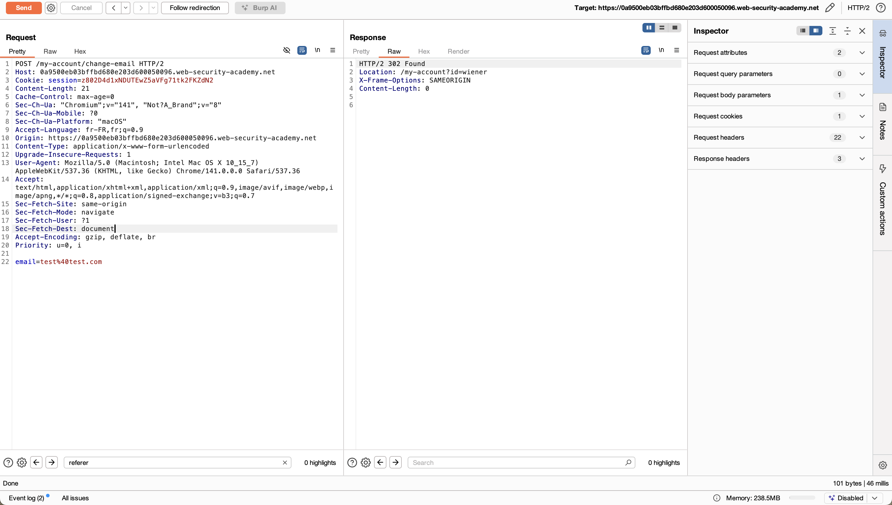
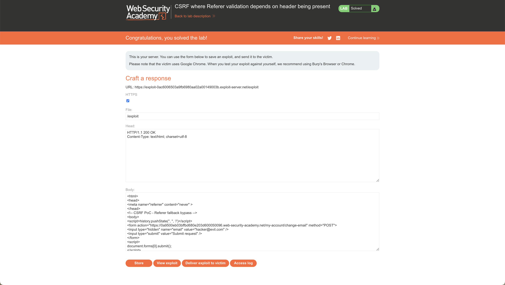

# Challenge 5: CSRF where Referer validation depends on header being present

## Nom / URL

**Nom du challenge :** Lab: CSRF where Referer validation depends on header being present  
**URL :** https://portswigger.net/web-security/csrf/bypassing-referer-based-defenses/lab-referer-validation-depends-on-header-being-present  
**Niveau :** PRACTITIONER

## Les étapes de découverte de la vulnérabilité

1. **Identification de la fonctionnalité vulnérable :**

   - L'application propose une fonctionnalité de changement d'adresse email
   - Cette fonctionnalité tente de bloquer les requêtes cross-domain en utilisant une validation basée sur le header Referer

2. **Analyse de la protection basée sur le Referer :**

   - Test initial : tentative d'attaque CSRF classique depuis un domaine externe
   - L'application rejette la requête car le header Referer indique un domaine différent
   - Observation : l'application vérifie la présence et la validité du header Referer

3. **Découverte du fallback non sécurisé :**

   - Envoi de la requête dans Burp Repeater pour tester différents scénarios
   - Test avec un domaine différent dans le header Referer : la requête est rejetée (comportement attendu)
   - **Découverte clé** : suppression complète du header Referer - la requête est acceptée !

4. **Compréhension de la vulnérabilité :**

   - L'application vérifie le Referer uniquement s'il est présent
   - Si le header Referer est absent, l'application utilise un fallback qui accepte la requête
   - Cette logique de validation est défectueuse : `if (referer exists && referer is valid) { reject } else { accept }`
   - La logique correcte devrait être : `if (referer exists && referer is valid) { accept } else { reject }`

5. **Création de l'exploit :**

   - Création d'une page HTML exploit standard pour CSRF
   - Ajout de la balise `<meta name="referrer" content="no-referrer">` dans le `<head>` de la page
   - Cette balise meta indique au navigateur de ne pas envoyer le header Referer lors des requêtes depuis cette page
   - L'exploit peut ainsi contourner la protection car aucune validation n'est effectuée en l'absence du header

6. **Confirmation de la vulnérabilité :**
   - L'exploit réussit à changer l'adresse email de la victime sans son consentement
   - Le laboratoire est résolu

## Le payload utilisé + screenshot

**Payload utilisé (exploit HTML) :**

```html
<html>
  <head>
    <meta name="referrer" content="no-referrer" />
  </head>
  <body>
    <form
      action="https://vulnerable-website.com/my-account/change-email"
      method="POST"
    >
      <input type="hidden" name="email" value="attacker@evil.com" />
    </form>
    <script>
      document.forms[0].submit();
    </script>
  </body>
</html>
```

**Explication du payload :**

- **Balise meta referrer** : `<meta name="referrer" content="no-referrer">` indique au navigateur de ne pas envoyer le header Referer
- **Formulaire CSRF** : Formulaire HTML standard qui soumet automatiquement une requête POST vers l'endpoint de changement d'email
- **Soumission automatique** : Le script JavaScript soumet automatiquement le formulaire au chargement de la page
- **Absence du header Referer** : Grâce à la balise meta, aucune validation Referer n'est effectuée et la requête est acceptée

**Screenshots :**





## Les recommandations pour sécuriser cette vulnérabilité

### 1. Validation stricte du Referer

- **Rejeter les requêtes sans Referer** : Si le header Referer est absent, la requête doit être rejetée par défaut
- **Logique de validation correcte** : Implémenter `if (referer exists && referer is valid) { accept } else { reject }` au lieu de l'inverse
- **Pas de fallback permissif** : Ne jamais accepter une requête simplement parce que le Referer est absent

### 2. Vérification de l'origine

- **Valider l'origine attendue** : Vérifier que le Referer correspond exactement au domaine de l'application
- **Vérification stricte** : Utiliser une comparaison exacte plutôt qu'une simple vérification de présence
- **Gérer les cas edge** : Considérer les sous-domaines et les chemins de manière appropriée

### 3. Ne pas se fier uniquement au Referer

- **Défense en profondeur** : Le Referer ne doit pas être la seule protection contre CSRF
- **Utiliser des tokens CSRF** : Implémenter des tokens CSRF comme mécanisme principal de protection
- **Combiner les défenses** : Utiliser le Referer en complément des tokens CSRF, pas comme remplacement

### 4. Gestion des navigateurs qui suppriment le Referer

- **Politique de Referrer** : Comprendre que les navigateurs peuvent supprimer le Referer pour des raisons de confidentialité
- **Alternative robuste** : Si le Referer est nécessaire, utiliser des tokens CSRF qui ne dépendent pas des headers
- **Documentation claire** : Documenter le comportement attendu et les cas limites

### 5. Tests de sécurité

- **Tester l'absence du Referer** : Inclure des tests qui vérifient le comportement lorsque le Referer est absent
- **Tests de contournement** : Tester explicitement les techniques de contournement comme `no-referrer`
- **Validation continue** : Intégrer ces tests dans les processus CI/CD

## Références

**Source principale des recommandations :**

- **OWASP - Cross-Site Request Forgery (CSRF)** : https://owasp.org/www-community/attacks/csrf
  - Cette page OWASP fournit des informations détaillées sur les attaques CSRF et les meilleures pratiques de sécurisation, y compris les défenses basées sur le Referer

**Références complémentaires :**

- **PortSwigger Web Security Academy - CSRF** : https://portswigger.net/web-security/csrf

  - Documentation officielle de PortSwigger sur les vulnérabilités CSRF et les techniques de bypass

- **PortSwigger - Bypassing Referer-based CSRF defenses** : https://portswigger.net/web-security/csrf/bypassing-referer-based-defenses

  - Guide spécifique sur les techniques de contournement des défenses CSRF basées sur le Referer

- **MDN Web Docs - Referrer-Policy** : https://developer.mozilla.org/en-US/docs/Web/HTTP/Headers/Referrer-Policy

  - Documentation sur la politique de Referrer et comment les navigateurs gèrent le header Referer

- **CWE-352: Cross-Site Request Forgery (CSRF)** : https://cwe.mitre.org/data/definitions/352.html

  - Classification CWE de cette vulnérabilité avec des exemples et des solutions

- **OWASP Top 10 - A05:2021 Security Misconfiguration** : https://owasp.org/Top10/A05_2021-Security_Misconfiguration/
  - Les vulnérabilités CSRF sont souvent liées à des problèmes de configuration de sécurité
